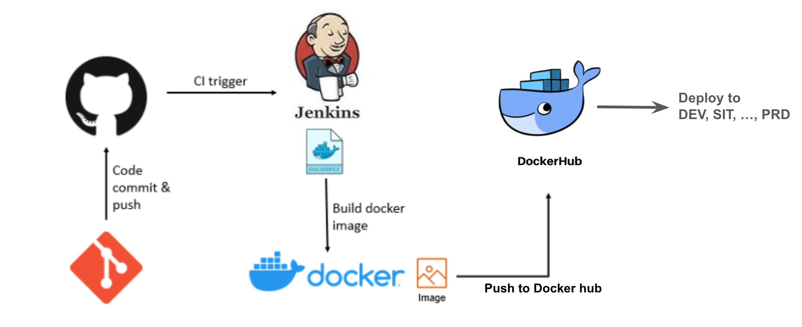
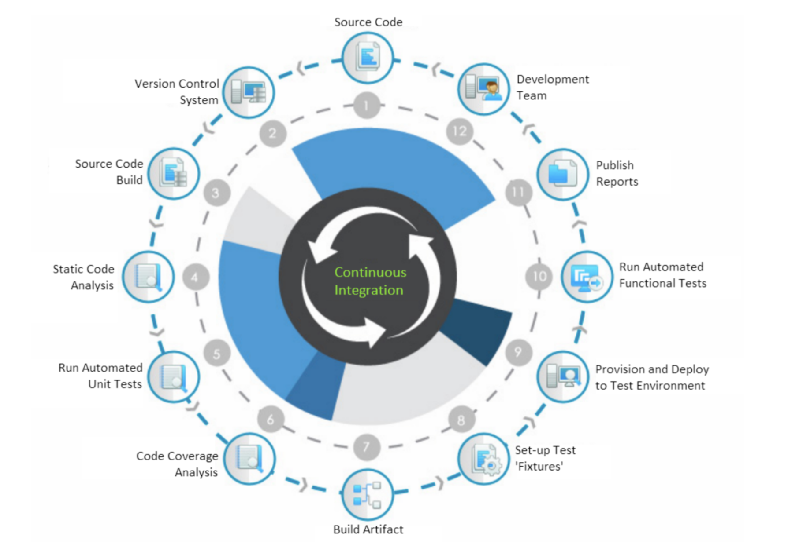

# Setup pipelines with jenkins



## 1. Install jenkins with Dockerfile

Build docker image name: `jenkins-dind`

```
docker compose -f docker-compose-jenkins.yml build  
```

Run container
```
docker compose -f docker-compose-jenkins.yml up -d
```

Go to `http://localhost:5555`

Copy your container id by `docker ps`

Get your password by replace `<CONTAINER_ID>` with output form `docker ps`

```
docker exec <CONTAINER_ID> cat /var/jenkins_home/secrets/initialAdminPassword
```

Choosing install suggested plugin and waiting

Filling username, password, full name and email 

Setting Jenkins URL: `http://localhost:5555/` (by default)

## 2. Add docker hub credential
Go to `http://localhost:5555/manage/credentials/store/system/domain/_/`

Click `Add credential` button

- Kind: Username with password
- Scope: Global
- Username: `YOUR_DOCKER_HUB_USER`
- Password: `YOUR_DOCKER_HUB_PASSWORD`
- ID: docker_hub
- Description: docker hub

## 3. Create & Setup pipelines



### 3.1 CI Pipeline

On first page click `+ New Item` menu

Enter pipeline name

Click Pipeline option and submit 

then input code to pipeline script

```
pipeline {
    agent any

    stages {
        stage('Checkout code') {
            steps {
              git branch: 'main', url: 'https://github.com/srankmeng/workshop-docker-cicd-20240403-04.git'
            }
        }
        stage('Code analysis') {
            steps {
                echo 'Code analysis'
            }
        }
        stage('Unit test') {
            steps {
                echo 'Unit test'
            }
        }
        stage('Code coverage') {
            steps {
                echo 'Code coverage'
            }
        }
        stage('Build images') {
            steps {
                sh 'docker compose -f ./json-server/docker-compose.yml build'
            }
        }
        stage('Setup & Provisioning') {
            steps {
                sh 'docker compose -f ./json-server/docker-compose.yml up -d'
            }
        }
        stage('Run api automate test') {
            steps {
                sh 'docker compose -f ./newman/docker-compose.yml build'
                sh 'docker compose -f ./newman/docker-compose.yml up'
            }
        }
    }
    post {
        always {
            sh 'docker compose -f ./json-server/docker-compose.yml down'
        }
    }
}

```


### 3.2 Push to registry after CI success

Add 'Push Docker Image to Docker Hub' stage after `stage('Run api automate test')`

>replace `xxxxx` with your docker hub account

```
stage('Push Docker Image to Docker Hub') {
    steps {
        withCredentials([usernamePassword(credentialsId: 'docker_hub'
        , passwordVariable: 'DOCKER_PASS', usernameVariable: 'DOCKER_USER')]) {
            sh 'docker login -u $DOCKER_USER -p $DOCKER_PASS'
            sh '''docker image tag my_json_server:1.0 xxxxx/my_json_server:$BUILD_NUMBER
                    docker image push xxxxx/my_json_server:$BUILD_NUMBER'''
        }        
    }
}
```

Go to docker hub to check images

### 3.3 Add deployment

Add 'Deploy application' stage after `stage('Push Docker Image to Docker Hub')`

> replace `xxxxx` with your docker hub account

```
stage('Deploy application') {
    steps {
        sh 'docker stop my_json_server_dev  || true'
        sh 'docker rm my_json_server_dev || true'
        sh 'docker run -p 8081:3000 --name my_json_server_dev -d xxxxx/my_json_server:$BUILD_NUMBER'       
    }
}
```
Go to `http://localhost:8081`

### 3.4 Separate CD from CI pipelines
Create the new pipeline name: `demo_deploy_pipeline` then input code to pipeline script
>replace `xxxxx` with your docker hub account
```
pipeline {
    agent any
    parameters {
        string(name: 'IMAGE_TAG', defaultValue: '', description: 'docker image tag version')
    }

    stages {
        stage('Deploy application') {
            steps {
                sh 'docker stop my_json_server_dev || true'
                sh 'docker rm my_json_server_dev || true'
                sh 'docker run -p 8081:3000 --name my_json_server_dev -d xxxxx/my_json_server:${IMAGE_TAG}'       
            }
        }
    }
    post {
        always {
            echo 'deploy done'
        }
    }
}

```

Back to the first pipeline:

- Remove `stage('Deploy application')` block

- Update script in `post` block
```
    post {
        always {
            sh 'docker compose -f ./json-server/docker-compose.yml down'
        }
        success {
            script {
                def currentBuildNumber = env.BUILD_NUMBER
                build job: 'demo_deploy_pipeline', parameters: [string(name: 'IMAGE_TAG', value: "${currentBuildNumber}")]
            }
        }
    }
```

### 3.5 Polling git for trigger pipelines
Go to the first pipeline: Configure > Build Triggers > Poll SCM > input `* * * * *`


## 4. Blue Ocean

Manage Jenkins > Plugins > Available plugins > search `blue ocean` > checked and install


